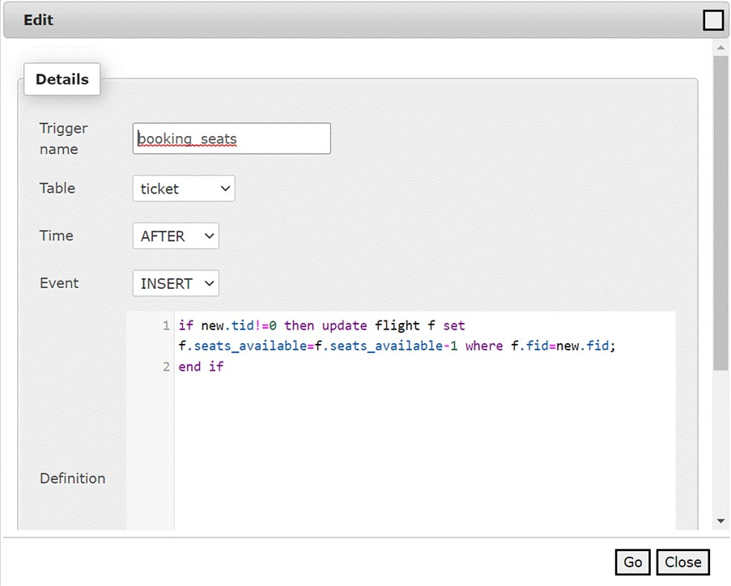

# indigo_airline_booking

## REQUIREMENT ANALYSIS:
Indigo maintains the flights with a unique flight number. Flights are operated on different routes. The tickets for these routes are sold with two variant seat selections: business class and economy class.  The indigo has different types of fleet and has various seating capacities. 

A customer can book one or more flights. Two or more customers may have the same mailing address and phone number(s). Booking has a unique booking number. They also provide inflight refreshments on a payment basis. Each Flight will have a minimum of two pilots, one acting as the primary pilot and the other as co-pilot. There will be a cabin crew to help passengers.

### ENTITIES-
●	Customer
●	Flight
●	Ticket
●	Route

### ATTRIBUTES-
●	Customer- CID, age, address, contact, email, class
●	Flight- fid, rid, departure_time, departure_date, Arrival_time, arrival_date, total_seats, seats_available, eco_amt, buss_amt, first_amt
●	Ticket- TID, cid, fid class, payment_method, refreshments
●	Route- rid, from, to

### RELATIONSHIP-
●	Flight has tickets 
●	The Flight has Route  
●	Flight provides inflight refreshment 
●	Passengers Books Ticket

## Conceptual Design

### ENTITY RELATION DIAGRAM-

 
## Logical Design 

#### Passenger –
create table passenger(cid int not null auto_increment,name varchar(20),age int, email varchar(20),address varchar(20), contact_no varchar(10), PRIMARY key(cid))
 
#### Route-

create table route(rid int not null AUTO_INCREMENT, from_city varchar(20),to_city varchar(20),PRIMARY key(rid));
 
#### Flight-
create table flight(fid varchar(10), rid int not null AUTO_INCREMENT, dep_time varchar(20),arr_time varchar(20),dep_date varchar(20),arr_date varchar(20),total_seats varchar(20),seats_available varchar(20),eco_amt varchar(10),buss_amt varchar(10),first_amt varchar(10),primary key(fid),FOREIGN key(rid) REFERENCES route(rid));
  
#### Ticket-
create table ticket(tid varchar(10),cid varchar(10),fid varchar(10),class varchar(20),amount varchar(20),payment_method varchar(20),refreshments varchar(20),primary key(tid),FOREIGN key(cid) REFERENCES passenger(cid),FOREIGN key (fid) REFERENCES flight(fid))
 
 
### Triggers used in Tickets-
 
•      Booking_seats-

•      Incrementing-
(https://drive.google.com/file/d/180m1GwbL9KGij35jQ6cejgKdgw8tw9cH/view?usp=sharing)
•      No_refreshments-
(https://drive.google.com/file/d/18Liy4UVQONrR8wn5KNQJy5fMojzKFCtd/view?usp=sharing)
•      Refreshments-
(https://drive.google.com/file/d/18Ueo3E4VMknIFcoHUd4EpIzRSuK8Oxad/view?usp=sharing)

